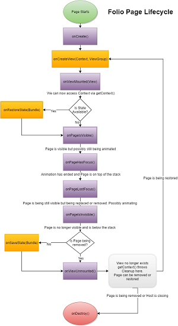

# Folio

Folio is a Page based navigation framework for Android with a simplified lifecycle and easy transition animations.
It's intended to fulfil a similar role to fragments while looking more like Activities.

[ ](https://bintray.com/frostymarvelous/maven/folio/_latestVersion)

## Users

Apps using Folio in production 

[](https://play.google.com/store/apps/details?id=com.umaplay.android)


### Current Version: 1.0.0

Folio follows [Semantic Versioning](http://semver.org/).

[](https://bintray.com/frostymarvelous/maven/folio``/view?source=watch)

## Installation

#### Gradle
Folio is available on jcenter.

```gradle
compile 'com.umaplay.oss:folio:1.0.0'
```

#### Manual Installation
Download the [aar artifact](artifacts/folio-1.0.0.aar) from the [artifacts](artifacts/) directory
and copy it into the libs directory of your app module.

Specify `libs` as a repository in your root gradle file.
```groovy
    allprojects {
        repositories {
            ...
            flatDir { dirs 'libs' }
        }
    }
``` 
   
Specify Fluxxan as dependency in your app's gradle file.
```groovy
    dependencies {
        compile fileTree(dir: 'libs', include: ['*.jar'])
        compile(name: 'folio-1.0.0', ext: 'aar')
        ...
    }
```

## Introduction
A Folio app is composed of simple Pages. If you are familiar with Activities, then you'll be right at home using Folio.
The lifecycle is simple and similar to that of Activities.

Folio is composed of the

1. Host
2. PageManager
3. Page
4. PageFactory

#### How it works

Pages are hosted inside of an `Activity`, `Fragment` or even another `Page`.
A `PageManager` handles the lifecycle of the pages and ensures everything remains consistent.
The Host is responsible for notifying the `PageManager` of lifecycle changes and also, can respond to changes in the Stack.

### Host

The Host can be an `Activity`, `Fragment` or even another `Page`. The Host must call the respective lifecycle methods on `PageManager`.

```java
    PageManager.onStart
    PageManager.onResume
    PageManager.onPause
    PageManager.onStop
    PageManager.onDestroy
    PageManager.onSaveInstanceState
```     

Folio provides a `PagedActivity` which handles the heavy lifting of notifying the `PageManager` of lifecycle changes, handling on `Activity.onBackPressed` and responding when the Stack is empty.

```java
    protected void onCreate(Bundle savedInstanceState) {
        super.onCreate(savedInstanceState);
        setContentView(R.layout.activity_main);
        
        //create and set our manager which we can retrieve later using getPageManager()
        setPageManager(new PageManager((ViewGroup) findViewById(R.id.container), this, App.getRefWatcher(), savedInstanceState));

        //if instance state is null, then this is our first launch, let's navigate to the main page
        //the page manager automatically restores the stack from the savedInstanceState
        if (savedInstanceState == null) {
            getPageManager().goTo(new RedPage.RedPageFactory());
        }
    }
```

### PageManager

The `PageManager` manages all pages. A Host can have as many instances as is feasible and Each Page can have a `NestedPageManager` for free (the library handles it's lifecycle for you).
Each manager requires a container which is simply a `ViewGroup` (`FrameLayout` works great), a `PageStackDelegate` which is notified when the stack is empty and importantly, an instance of `com.squareup.leakcanary.RefWatcher` to help catch memory leaks.
We enforce the use of the RefManager because a memory leak can bring the entire application to it's knees very quickly.

When navigating to a page, you can provide a `PageAnimatorFactory` which animates the addition and removal of Pages. By default, Pages are not animated.
Folio includes `AnimatorUtils` which can help you create simple translation and fade animators. But you are free to create your own.

You can add `StackChangedListener`s to listen to changes in the stack and react accordingly. For example, to update an actionbar (if you choose to manage it in the host).

### Page

A Page is a self contained "screen" in a Folio application with a simple lifecyle and state preservation. Pages are modelled after activities and therefore easy to use.

##### Lifecycle

The lifecycle is simple and easy to understand. It's been detailed in the diagram below. Click to view large size.

[](assets/lifecycle.png)

##### Context

You can get a context instance by calling `getContext()` between `onViewMounted` and `onViewUnmounted`. Doing so outside of this will throw an `IllegalStateException`.

#### NestedPageManager

A Page can get a cheap PageManager by calling `getNestedPageManager(ViewGroup)`. 
The `NestedPageManager` is considered cheap because it is handled by the framework internally and you don't have to worry about the lifecycle or state handling.

This makes creating a Master/Detail view very easy to implement.


#### Caveat

Because the Page lifecycle is independent of the Host's, using the context for libraries that rely on the Lifecycle to clean up resources can lead to increased memory usage e.g. Glide.
You wil need to find a way to bypass it. Refer to this [gist](https://gist.github.com/frostymarvelous/c5c1dbaa11ce3b0c8329d529ed01ae95) for an implementation that supports Glide.


### PageFactory

`PageFactory` handles the creation of Pages and storing of some information related to the Page. The provided `BasePageFactory` provide an implementation that handles all the heavy lifting.

#### Factory Guidelines 

The `PageFactory` and `PageAnimatorFactory` must be serializable.
 
1. Ensure that any properties are serializable.
2. If nested, make sure it is a static class.
3. Do not use an anonymous class

If the Factory cannot be serialized, the app will crash.


### Contributing

Thank you for taking the time to contribute.
But before you do, please read our [contribution guidelines](CONTRIBUTING.md). They are simple, we promise.


### Todo
  - Writing Tests

	
### License
MIT

